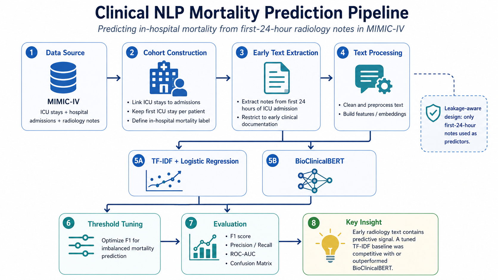
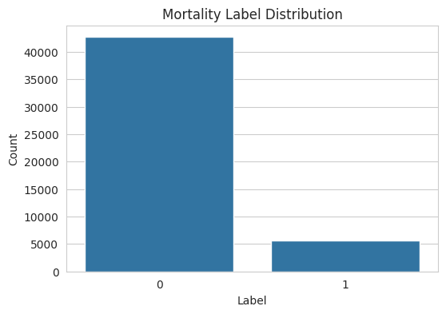
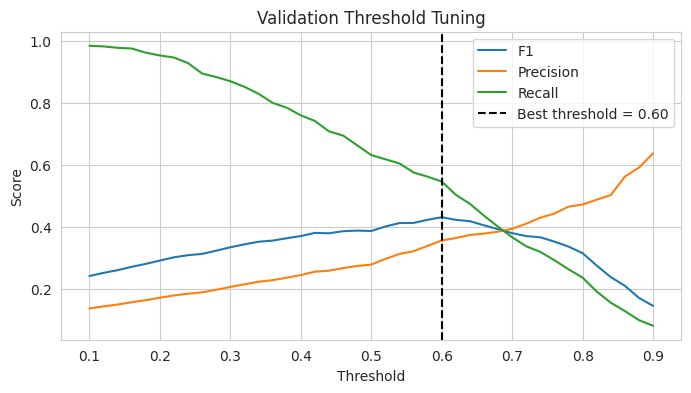
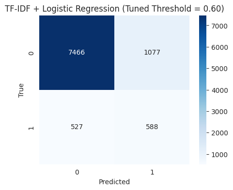

# Clinical NLP Mortality Prediction

Predicting ICU in-hospital mortality from first-24-hour radiology notes using MIMIC-IV, TF-IDF + Logistic Regression, and BioClinicalBERT.

This project evaluates whether early clinical text contains enough signal to support mortality risk prediction. I constructed an ICU cohort from MIMIC-IV, restricted predictors to radiology notes written within the first 24 hours of ICU admission, and compared an interpretable linear NLP baseline against a clinical transformer model.

> This project is intended for research and educational purposes only. It is not a diagnostic tool or clinical decision-making system.



## Overview

Early risk prediction is difficult because the first 24 hours of clinical documentation are incomplete, noisy, and often limited to specific findings. This project tests whether those early radiology notes still contain measurable signal for in-hospital mortality prediction.

The task is framed as binary classification:

- **Input:** Radiology notes from the first 24 hours of ICU admission
- **Target:** In-hospital mortality
- **Dataset:** MIMIC-IV ICU stays, hospital admissions, and radiology notes
- **Models:** TF-IDF + Logistic Regression and BioClinicalBERT
- **Evaluation focus:** F1 score, precision, recall, ROC AUC, PR AUC, confusion matrices, and threshold tuning

## Dataset and Cohort

This project uses MIMIC-IV, a de-identified critical care database containing hospital admissions, ICU stays, clinical notes, and patient outcomes.

The raw MIMIC-IV data is **not included** in this repository due to data use restrictions. Access requires PhysioNet approval and completion of the required training.

High-level cohort construction:

- Linked ICU stays to hospital admissions
- Extracted radiology notes from the first 24 hours of ICU admission
- Aggregated early note text at the ICU stay level
- Created a binary in-hospital mortality label
- Split the cohort into training, validation, and test sets
- Restricted predictors to early documentation only to reduce data leakage



## Methods

### TF-IDF + Logistic Regression

The baseline model uses TF-IDF vectorization followed by Logistic Regression. This approach is fast, interpretable, and effective for sparse clinical text classification.

The model also supports feature coefficient analysis, making it possible to inspect which terms are most associated with higher or lower predicted mortality risk.

### BioClinicalBERT

BioClinicalBERT was used as a transformer-based clinical NLP comparison. This model provides contextual language representations pretrained on biomedical and clinical text.

However, the BioClinicalBERT experiment was limited by compute constraints and trained on a smaller subset of the data. Because of that, the comparison should be interpreted as a practical project-level comparison rather than definitive evidence that one architecture is always better for this task.

### Threshold Tuning

Because in-hospital mortality is an imbalanced outcome, accuracy and default 0.50 thresholds are not sufficient. I tuned classification thresholds on the validation set to optimize F1 and better evaluate the precision-recall tradeoff for the mortality class.



## Evaluation

Models were evaluated using:

- F1 score
- Precision
- Recall
- ROC AUC
- PR AUC
- Confusion matrix
- Threshold sweep analysis

These metrics are more appropriate than accuracy alone because the positive mortality class is clinically important and less frequent.

## Results

The TF-IDF + Logistic Regression baseline performed strongly and provided the most interpretable results. The model identified clinically meaningful terms associated with mortality risk, including severe findings such as **cardiac arrest**, **shock**, **metastatic disease**, **ECMO**, and **ascites**.

BioClinicalBERT provided a transformer-based comparison, but its lower performance should be interpreted in the context of subset-based training and limited compute. The result suggests that a well-tuned linear baseline can be highly competitive for this task, especially when interpretability and training efficiency matter.



## Key Takeaways

- First-24-hour radiology notes contain measurable signal for in-hospital mortality prediction.
- Threshold tuning is important for imbalanced clinical classification.
- TF-IDF + Logistic Regression performed strongly and produced interpretable feature coefficients.
- BioClinicalBERT was limited by computational constraints, so the model comparison should not be overgeneralized.
- Early radiology notes alone are not enough for reliable clinical deployment, but they can support exploratory risk modeling.

## Model Interpretation

One advantage of the TF-IDF + Logistic Regression model is that its coefficients can be inspected directly.

Examples of terms associated with higher predicted mortality risk included:

- cardiac arrest
- shock
- metastatic
- ECMO
- ascites

Examples of terms associated with lower predicted mortality risk included more routine or less severe clinical language, such as:

- normal
- postoperative

These associations are predictive patterns, not causal explanations. The model is learning correlations in early clinical documentation, not determining whether specific findings cause mortality.

## Limitations and Future Work

The strongest result from this project is not that one model family is universally better than another, but that early radiology text contains usable signal for mortality prediction and that threshold selection matters in imbalanced clinical classification.

The TF-IDF + Logistic Regression baseline was trained on the full prepared cohort and produced interpretable feature coefficients. This interpretability is a major advantage of the baseline approach, especially in a clinical setting where understanding model behavior is important.

However, the BioClinicalBERT comparison should be interpreted with caution. The transformer model was trained on a subset of the data due to computational constraints, which likely limited its performance ceiling. Therefore, the result is best viewed as a practical comparison between a fully trained linear baseline and a compute-constrained transformer experiment, not as definitive evidence that TF-IDF is inherently better for this task.

Future work could extend the project in several directions:

- **Full-cohort transformer training:** Fine-tune BioClinicalBERT or another clinical encoder on the full cohort using stronger GPU resources.
- **Structured LLM feature extraction:** Use a decoder-based language model to transform raw radiology notes into structured summaries, clinical concepts, or risk-factor features before downstream classification.
- **Hybrid modeling:** Combine structured LLM-extracted features with TF-IDF, clinical embeddings, or structured EHR variables.
- **Richer clinical inputs:** Add vitals, labs, diagnoses, procedures, demographics, comorbidities, and medication data.
- **Expanded note sources:** Compare radiology-only text against nursing notes, physician notes, emergency department notes, and discharge summaries.
- **Probability calibration:** Calibrate predicted probabilities so outputs better reflect clinical risk rather than only binary class labels.
- **Temporal validation:** Test model performance across admission years to evaluate robustness under distribution shift.
- **Error analysis:** Review false negatives and false positives more closely, since both types of error have important clinical consequences.

## Repository Structure

```text
clinical-nlp-mortality-prediction/
├── README.md
├── clinical_nlp_mortality_prediction.ipynb
├── report.pdf
├── project_pipeline.png
└── images/
    ├── mortality_label_distribution.png
    ├── tfidf_logistic_regression_threshold_tuning.png
    ├── tfidf_logistic_regression_confusion_matrix_default.png
    ├── tfidf_logistic_regression_confusion_matrix_tuned_threshold.png
    ├── bioclinicalbert_threshold_tuning.png
    ├── bioclinicalbert_confusion_matrix_default.png
    └── bioclinicalbert_confusion_matrix_tuned_threshold.png
```

## How to Run

The notebook is provided for reproducibility of the modeling workflow, but the raw MIMIC-IV data is not included because it requires approved access through PhysioNet.

To reproduce the project:

1. Obtain approved access to MIMIC-IV and MIMIC-IV-Note through PhysioNet.
2. Download the required ICU stay, admission, and radiology note tables.
3. Update the notebook file paths to point to the local data location.
4. Run the notebook cells in order to construct the cohort, train models, tune thresholds, and evaluate results.

## Disclaimer

This project is for research and educational purposes only. It is not intended for diagnosis, treatment decisions, clinical deployment, or real-time patient risk scoring.
